## Cyclone Tracking {.smaller}

:::: {.columns}
::: {.column width="55%"}
- Several cyclone tracking software tools exist:
  - Tempest Extremes [@ullrich2021tempestextremes],
  - TRACK [@hodges2017well],
  - TSTORMS [@vitart2001seasonal],
  - etc.

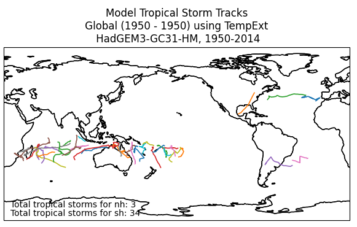{style="width: 80%; text-align: center;"}
:::
::: {.column style="width: 45%; text-align: center;"}
- Generic approach: detect and stitch
- Each has its own:
  - implementation
  - data representation
  - licensing
  - code
  - documentation (or not...)
:::
::::

:::{.notes}
- Explain the diversity of cyclone tracking software and the challenges of inconsistent data representations.
- Classic antipattern in research software - developed to do the single thing required ta that time as easilyt as possible.
:::

<!-- =============================================================================== -->

## TCTrack {.smaller}

:::: {.columns}
::: {.column width="50%"}
- TCTrack aims to provide:
  - Unified interface for different algorithms,
  - Standardised CF-compliant outputs,
      - As [Trajectory format H4(.1)](https://cfconventions.org/Data/cf-conventions/cf-conventions-1.11/cf-conventions.html#trajectory-data) from CF conventions.
      - Using [`cf-python`](https://ncas-cms.github.io/cf-python/) library
  - Data for repeated use:
    - different time,
    - different place.
:::
::: {.column style="text-align: center;"}
{width=80%}

[/Cambridge-ICCS/TCTrack](https://github.com/Cambridge-ICCS/TCTrack)

[ tctrack.readthedocs.io](https://tctrack.readthedocs.io/en/latest/)

:::
::::

:::{.notes}
- Highlight TCTrack's goals:
  - Unified interface for multiple algorithms.
  - Standardized CF-compliant outputs.
  - Use of the Trajectory format H4 from CF conventions.
- Mention that examples of input and output formats will follow in later slides.
:::

<!-- =============================================================================== -->

## Wrap vs. Reimplement {.smaller}

- We initially planned to reimplement the tracking algorithms in python.
- But they had dozens of source files with many thousands of lines of code.
- So we chose to wrap them instead.


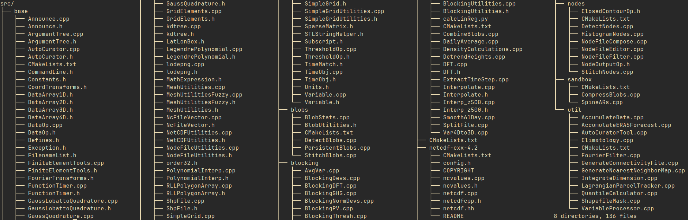

- It is also possible for new trackers to be implemented directly in the library.

<!-- =============================================================================== -->

## Code Structure {.smaller}

::: {style="font-size: 150%;"}
```
src/tctrack/
│   ├── __init.py__
│   ├── core/
│   ├── tempest_extremes/
│   ├── track/
│   ├── tstorms/
│   └── utils/
├── tutorial/
└── tests/
```
:::

<br>

Each tracker module contains classes for:

- Input parameter lists, e.g. `TEDetectParameters`.
- Running the tracker & outputing results, e.g. `TETracker`.

<!-- =============================================================================== -->

## Code Usage {.smaller}

::: {.panel-tabset}

## Tempest Extremes

```python
from tctrack import tempest_extremes as te

# Define tracker parameters
dn_params = te.TEDetectParameters(
    in_data=["psl_data.nc", "zg_data.nc", "orog_data.nc", "sfcWind_data.nc"],
    search_by_min="psl",
    time_filter="6hr",
    ...
)

sn_params = te.TEStitchParameters(
    caltype="360_day",
    max_sep=8.0,
    min_time="54h",
    ...
)

# Create and run tracker
tracker = te.TETracker(dn_params, sn_params)
tracker.run_tracker("te_trajectories.nc")

# Alternatively, run manually
tracker.detect()
tracker.stitch()
tracker.to_netcdf("te_trajectories.nc")
```

## TSTORMS

```python
from tctrack import tstorms

# Define tracker parameters
tstorms_params = tstorms.TSTORMSBaseParameters(
    tstorms_dir="path/to/tstorms/installation/",
    output_dir="path/to/place/outputs/",
    input_dir="path/to/input/files/",
)

detect_params = tstorms.TSTORMSDetectParameters(
    vort_crit=3.5e-5,
    tm_crit=0.0,
    thick_crit=50.0,
    ...
)

stitch_params = tstorms.TSTORMSStitchParameters(
    r_crit=900.0,
    wind_crit=17.0,
    ...
)

# Create and run tracker
tracker = tstorms.TSTORMSTracker(tstorms_params, detect_params, stitch_params)
tracker.run_tracker("tstorms_trajectories.nc")

# Alternatively, run manually
tracker.detect()
tracker.stitch()
tracker.to_netcdf("tstorms_trajectories.nc")
```

## TRACK

```python
from tctrack.track import TRACKParameters, TRACKTracker

# Define tracker parameters
params = TRACKParameters(
    base_dir="/path/to/track",
    input_file="ua_va_file_F256.nc",
    wind_var_names=("ua", "va"),
)

# Create and run tracker
tracker = TRACKTracker(params)
tracker.run_tracker("track_trajectories.nc")

# Alternatively, run manually
tracker.calculate_vorticity()
tracker.spectral_filtering()
tracker.tracking()
tracker.filter_trajectories()
tracker.to_netcdf("track_trajectories.nc")
```

:::

<!-- =============================================================================== -->

## Docs {.smaller}

<br>
Online documentation describing usage.

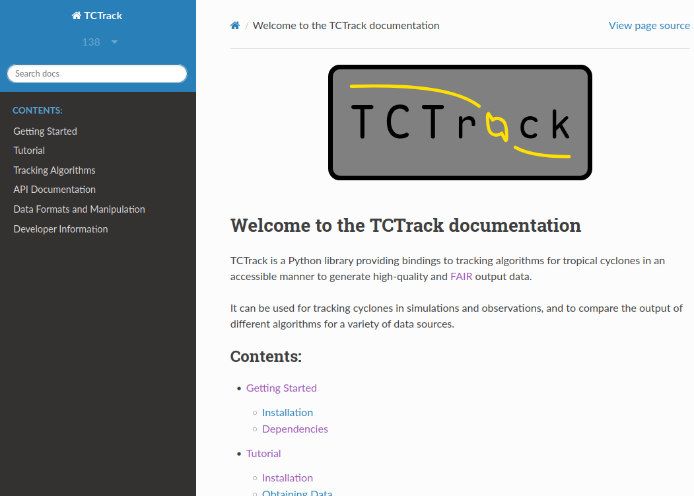

<!-- =============================================================================== -->

## Docs - Tutorial {.smaller}

<br><br>

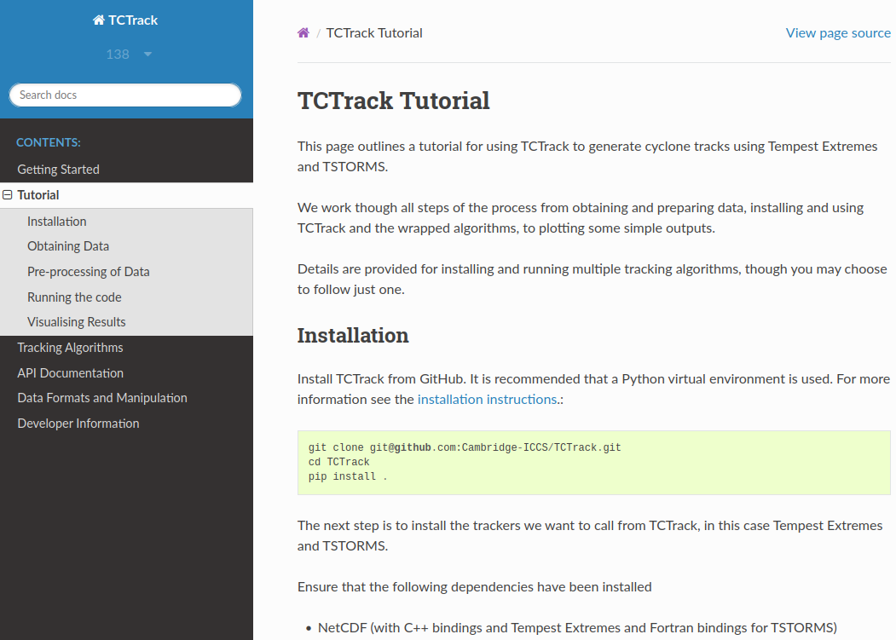

<!-- =============================================================================== -->

## Docs - Algorithms {.smaller}

<br><br>

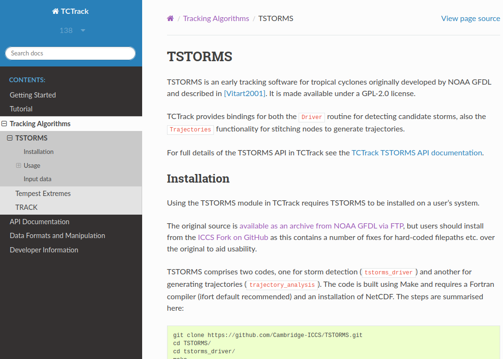

<!-- =============================================================================== -->

## Docs - Preprocessing data {.smaller}

<br><br>

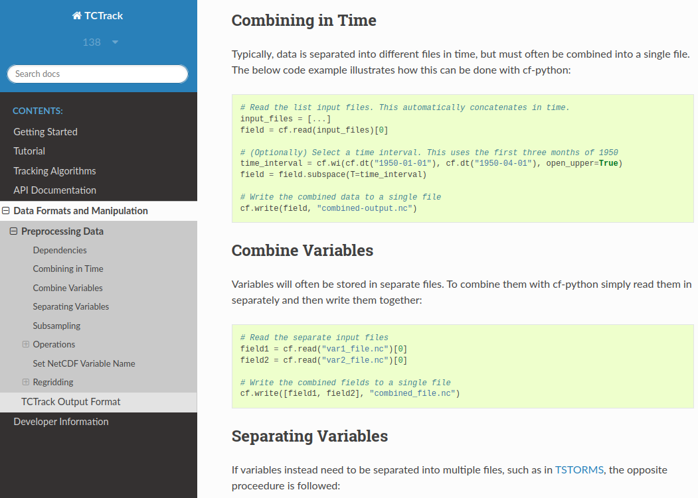

<!-- =============================================================================== -->

## Docs - [User API](https://tctrack.readthedocs.io/en/latest/api/index.html) {.smaller}

<br>
Includes details of input parameters for each algorithm.

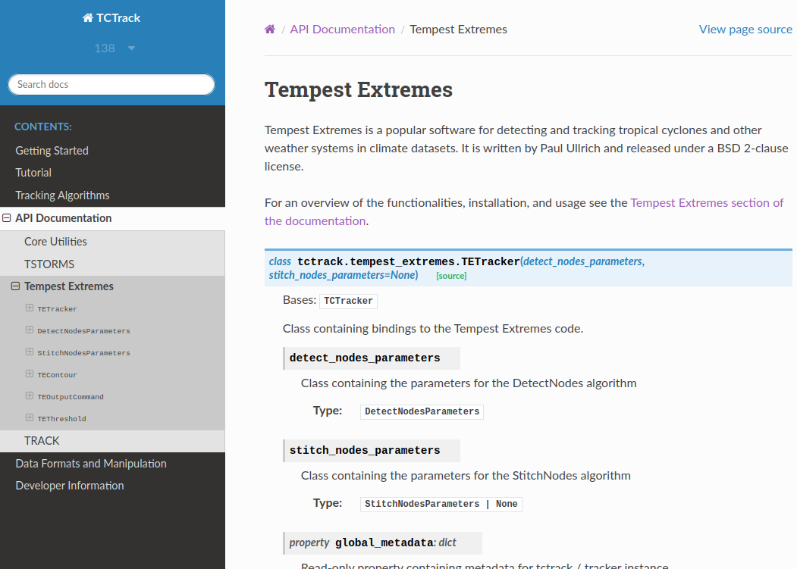

<!-- =============================================================================== -->

## TCTrack Output {.smaller}

Results for 3 months of tropical cyclones JFM 1950 from HadGEM3 data

:::: {.columns}
::: {.column style="width: 50%; text-align: center;"}
Tempest Extremes

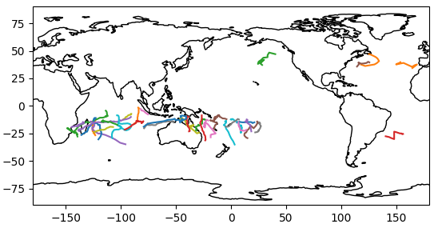{width=70%}
:::
::: {.column style="width: 50%; text-align: center;"}
TSTORMS

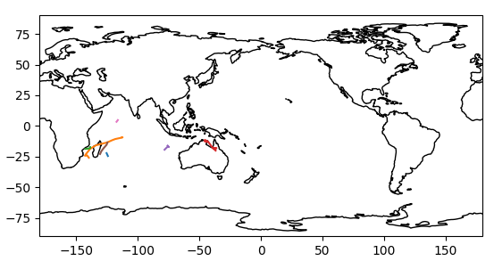{width=70%}
:::
::: {.column style="width: 100%; text-align: center;"}
TRACK

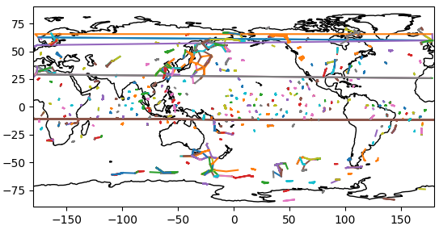{width=35%}
:::
::::

<!-- =============================================================================== -->

## FAIR {.smaller}

:::: {.columns}
::: {.column width="50%"}
FAIR data and software is increasingly important:

- Findable
- Accessible
- Interoperable
- Reusable

:::
::: {.column .v-center-container style="text-align: center;"}
{width=100%}


:::
::::

:::{.aside}
See FAIR data in @wilkinson2016fair and Fair for Research Software in @barker2022introducing.
:::

::: {.attribution}
BSBR by the SSI under fair use
:::

:::{.notes}
- What is FAIR
  - Originally for data, now also for software
:::

<!-- =============================================================================== -->

## Focus point: CF-Conventions {.smaller}

:::: {.columns}
::: {.column style="width: 60%; text-align: center;"}
- Climate and Forecast Conventions: [cfconventions.org/](https://cfconventions.org/)
- Community standard
- Sharing and using NetCDF data.
  - Particularly metadata
- Ensure data is self-describing and interoperable.

TCTrack uses the CF-Conventions' tool `cf-python` to:

- store data in [Trajectory format H4(.1)](https://cfconventions.org/Data/cf-conventions/cf-conventions-1.11/cf-conventions.html#trajectory-data)
- ensure that output data is CF-compliant.
:::
::: {.column style="width: 40%; text-align: center;"}
{width=80% style="background-color: #ffffff; padding: 1em; border-radius: 5px;"}
:::
::::

::: {.attribution}
CF Field flowchart from the cf-python documentation
:::

<!-- =============================================================================== -->

## Raw Output Data: TSTORMS {.smaller}

:::{style="font-size: 0.85em; white-space: pre;"}
```plaintext
start     2  1950     1     4     0
   54.67  -22.15   16.65  999.23   0.00027446  1950     1     4     0
   55.72  -24.49   17.38  997.83   0.00031078  1950     1     5     0
start    13  1950     1     6     0
   67.32   -9.26   17.90 1002.11   0.00065708  1950     1     6     0
   67.68   -9.26   15.32 1003.88   0.00044106  1950     1     7     0

...

start     4  1950     1     8     0
   41.31  -17.23   18.26  996.48   0.00078623  1950     1     8     0
   41.31  -17.93   16.40  996.75   0.00065824  1950     1     9     0
   40.25  -18.40   12.33 1000.01   0.00043762  1950     1    10     0
   37.44  -18.63   12.80 1001.78   0.00039998  1950     1    11     0

...

```
:::

<!-- =============================================================================== -->

## Raw Output Data: TE {.smaller}

:::{style="font-size: 0.85em; white-space: pre;"}
```plaintext
track_id, year, month, day, hour, i, j, lon, lat, psl, orog, sfcWind
0, 1950, 1, 1, 6, 572, 320, 201.269531, -14.882813, 1.003118e+05, 0.000000e+00, 1.389075e+01
0, 1950, 1, 1, 12, 569, 318, 200.214844, -15.351562, 1.001075e+05, 0.000000e+00, 1.546506e+01
0, 1950, 1, 1, 18, 567, 317, 199.511719, -15.585937, 1.001445e+05, 0.000000e+00, 1.590697e+01
0, 1950, 1, 2, 0, 565, 320, 198.808594, -14.882813, 1.000154e+05, 0.000000e+00, 1.531368e+01
0, 1950, 1, 2, 6, 563, 321, 198.105469, -14.648438, 1.001127e+05, 0.000000e+00, 1.522812e+01
0, 1950, 1, 3, 0, 555, 321, 195.292969, -14.648438, 1.001399e+05, 0.000000e+00, 1.413657e+01

...

1, 1950, 1, 1, 6, 163, 332, 57.480469, -12.070312, 1.005820e+05, 0.000000e+00, 1.153856e+01
1, 1950, 1, 1, 12, 161, 327, 56.777344, -13.242188, 1.003331e+05, 0.000000e+00, 9.956528e+00
1, 1950, 1, 1, 18, 158, 324, 55.722656, -13.945312, 1.005362e+05, 0.000000e+00, 1.123346e+01
1, 1950, 1, 2, 0, 157, 322, 55.371094, -14.414062, 1.001472e+05, 0.000000e+00, 1.184854e+01
1, 1950, 1, 2, 6, 156, 317, 55.019531, -15.585937, 1.003412e+05, 0.000000e+00, 1.290700e+01
1, 1950, 1, 2, 12, 155, 311, 54.667969, -16.992188, 1.001394e+05, 0.000000e+00, 1.204769e+01

...
```
:::

:::{.notes}
- Example of raw output from Tempest Extremes in CSV format.
- Highlights the lack of metadata and inconsistent formatting.
:::

<!-- =============================================================================== -->

## Raw Output Data: TRACK {.smaller}

:::{style="font-size: 0.85em; white-space: pre;"}
```plaintext
netcdf ff_trs.test_out {
dimensions:
        tracks = 703 ;
        record = UNLIMITED ; // (78 currently)
variables:
        int TRACK_ID(tracks) ;
                TRACK_ID:add_fld_num = 0 ;
                TRACK_ID:tot_add_fld_num = 0 ;
                TRACK_ID:loc_flags = "" ;
        int FIRST_PT(tracks) ;
        int NUM_PTS(tracks) ;
        int index(record) ;
        int time(record) ;
        float longitude(record) ;
        float latitude(record) ;
        float intensity(record) ;
}
```
:::

<!-- =============================================================================== -->

## CF-Compliant Output Data {.smaller}

All TCTrack outputs are CF-Compliant NetCDF as follows:

:::{style="font-size: 0.85em; white-space: pre;"}
```json
netcdf my_cf_tracks {
dimensions:
        trajectory = 36 ;
        observation = 60 ;
variables:
        int64 trajectory(trajectory) ;
                trajectory:standard_name = "trajectory" ;
                trajectory:cf_role = "trajectory_id" ;
                trajectory:long_name = "trajectory index" ;
        int64 observation(observation) ;
                observation:standard_name = "observation" ;
                observation:long_name = "observation index" ;
        double time(trajectory, observation) ;
                time:standard_name = "time" ;
                time:long_name = "time" ;
                time:units = "days since 1970-01-01" ;
                time:calendar = "360_day" ;
        double lat(trajectory, observation) ;
                lat:standard_name = "lat" ;
                lat:long_name = "latitude" ;
                lat:units = "degrees_north" ;
        double lon(trajectory, observation) ;
                lon:standard_name = "lon" ;
                lon:long_name = "longitude" ;
                lon:units = "degrees_east" ;
        double grid_i(trajectory, observation) ;
                grid_i:long_name = "longitudinal grid index" ;
                grid_i:coordinates = "time lat lon" ;
        double grid_j(trajectory, observation) ;
                grid_j:long_name = "latitudinal grid index" ;
                grid_j:coordinates = "time lat lon" ;
        double air_pressure_at_sea_level(trajectory, observation) ;
                air_pressure_at_sea_level:standard_name = "air_pressure_at_sea_level" ;
                air_pressure_at_sea_level:long_name = "Sea Level Pressure" ;
                air_pressure_at_sea_level:units = "Pa" ;
                air_pressure_at_sea_level:coordinates = "time lat lon" ;
                air_pressure_at_sea_level:cell_methods = "area: point" ;
        double surface_altitude(trajectory, observation) ;
                surface_altitude:standard_name = "surface_altitude" ;
                surface_altitude:long_name = "Surface Altitude" ;
                surface_altitude:units = "m" ;
                surface_altitude:coordinates = "time lat lon" ;
                surface_altitude:cell_methods = "area: point" ;
        double wind_speed(trajectory, observation) ;
                wind_speed:standard_name = "wind_speed" ;
                wind_speed:long_name = "Near-Surface Wind Speed" ;
                wind_speed:units = "m s-1" ;
                wind_speed:coordinates = "time lat lon" ;
                wind_speed:cell_methods = "area: maximum (great circle of radius 2.0 degrees)" ;

// global attributes:
                :Conventions = "CF-1.12" ;
                :featureType = "trajectory" ;
                :tctrack_version = "0.1.dev155+gbe2798b37" ;
                :tctrack_tracker = "TETracker" ;
                :detect_nodes_parameters = "{\"in_data\": [\"psl_data.nc\", \"zg_data.nc\", \"orog_data.nc\", \"sfcWind_data.nc\"], \"out_header\": true, \"output_file\": \"nodes_out.dat\", \"search_by_min\": \"psl\", \"search_by_max\": null, \"closed_contours\": [{\"var\": \"psl\", \"delta\": 200.0, \"dist\": 5.5, \"minmaxdist\": 0.0}, {\"var\": \"zgdiff\", \"delta\": -6.0, \"dist\": 6.5, \"minmaxdist\": 1.0}], \"merge_dist\": 6.0, \"time_filter\": \"6hr\", \"lat_name\": \"lat\", \"lon_name\": \"lon\", \"min_lat\": 0.0, \"max_lat\": 0.0, \"min_lon\": 0.0, \"max_lon\": 0.0, \"regional\": false, \"output_commands\": [{\"var\": \"psl\", \"operator\": \"min\", \"dist\": 0.0}, {\"var\": \"orog\", \"operator\": \"max\", \"dist\": 0.0}, {\"var\": \"sfcWind\", \"operator\": \"max\", \"dist\": 2.0}]}" ;
                :stitch_nodes_parameters = "{\"output_file\": \"tracks_out.txt\", \"in_file\": \"nodes_out.dat\", \"in_list\": null, \"in_fmt\": [\"lon\", \"lat\", \"psl\", \"orog\", \"sfcWind\"], \"allow_repeated_times\": false, \"caltype\": \"360_day\", \"time_begin\": null, \"time_end\": null, \"max_sep\": 8.0, \"max_gap\": \"24h\", \"min_time\": \"54h\", \"min_endpoint_dist\": 8.0, \"min_path_dist\": 0, \"threshold_filters\": [{\"var\": \"lat\", \"op\": \"<=\", \"value\": 50, \"count\": 10}, {\"var\": \"lat\", \"op\": \">=\", \"value\": -50, \"count\": 10}, {\"var\": \"orog\", \"op\": \"<=\", \"value\": 150, \"count\": 10}, {\"var\": \"sfcWind\", \"op\": \">=\", \"value\": 10, \"count\": 10}], \"prioritize\": null, \"add_velocity\": false, \"out_file_format\": \"gfdl\", \"out_seconds\": false}" ;
}
```
:::

<!-- =============================================================================== -->

## Development Process {.smaller}

- Development organised using a Kanban project board.
- Provides prioritisation of tasks and those left for future work.

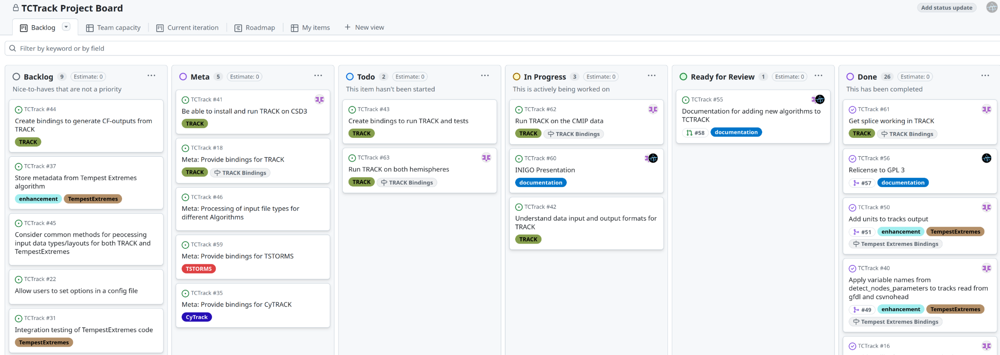{width=100%}

<!-- =============================================================================== -->

## Testing and Continuous Integration {.smaller}

Unit tests to verify additions to the code

Testing and code quality checks run continuously using GitHub Actions

:::{.r-stack}
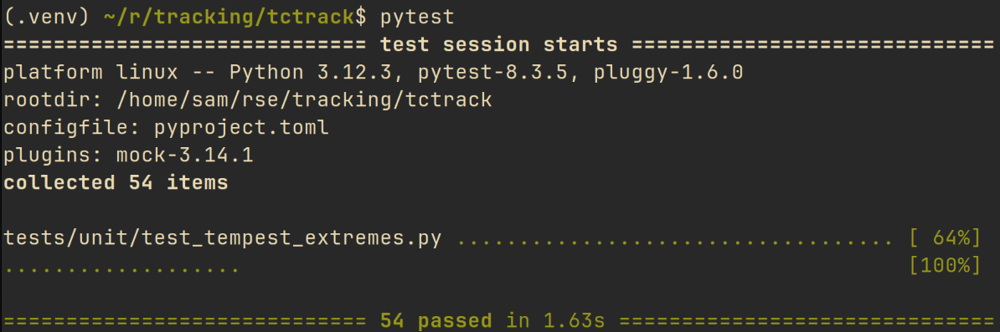{style="width: 60%; display: block; margin: 1em auto;"}

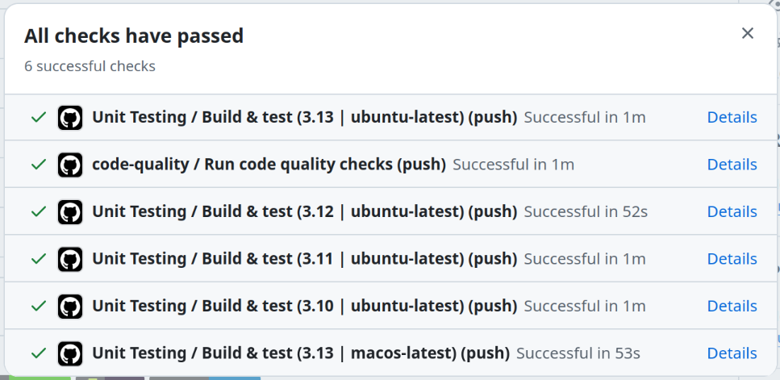{style="width: 65%; display: block; margin: 1em auto;" .fragment}
:::

<!-- =============================================================================== -->

## Outreach {.smaller}

TCTrack has been presented at the following:

- CF-Conventions annual Meeting 2025
- Internal presentation to ICCS 
- Presentation to INIGO Quarterly meetings
- Poster submission to European Geosciences Union 2026 in _"Integrated advances in tropical cyclones: linking physics, impacts, risks and adaptation"_

We intend to submit a publication to JOSS (Journal of Open Source Software) and present the work at RSECon as an example of facilitating FAIR data practices in science and industry.

Support in publicising this work and finding new users and contributors is appreciated.

<!-- =============================================================================== -->

## Future Work - MPhil projects {.smaller}

- Use TCTrack on CMIP data to look at intensity and frequency of storms.
- Larger scale test of the package.
- Identify potential areas for improvement.

<!-- =============================================================================== -->


## Future Work - Development {.smaller}

- Publish the package on PyPI and conda-forge
- Fix the TRACK algorithm
- Wrap further storm tracking softwares
- Implement new tracking approaches in development by researchers
- Basic visualisation using [huracanpy](https://github.com/Huracan-project/huracanpy)
- Development of storm tracks web-dashboard by project partners

<!-- =============================================================================== -->

## Thanks for Listening {.smaller}

:::: {.columns}

::: {.column style="width:20%; font-size: 85%;"}
Get in touch:
:::
::: {.column style="width: 40%; font-size: 85%;"}
 \ Jack Atkinson

 \ [jackatkinson.net](https://jackatkinson.net)

 \ [jwa34[AT]cam.ac.uk](mailto:jwa34@cam.ac.uk)

 \ [jatkinson1000](https://github.com/jatkinson1000)

 \ [\@jatkinson1000\@hachyderm.io](https://hachyderm.io/@jatkinson1000)
:::
::: {.column style="width: 40%; font-size: 85%;"}
 \ Sam Avis

 \ [sa2329[AT]cam.ac.uk](mailto:sa2329@cam.ac.uk)

 \ [sjavis](https://github.com/sjavis)
:::
::::

:::: {.columns style="vertical-align: bottom;"}
::: {.column style="width: 35%; vertical-align: bottom;"}


[/Cambridge-ICCS/TCTrack](https://github.com/Cambridge-ICCS/TCTrack)
:::

::: {.column style="width: 60%; vertical-align: bottom;"}
<br>

Thanks to Alison Ming

\

The ICCS received support from the<br>Inigo InSPIRe project
:::
::::

<!-- {style="width: 20%; height: 30%; object-fit: cover; object-position: 0 0;" .absolute top=33% right=5%} -->
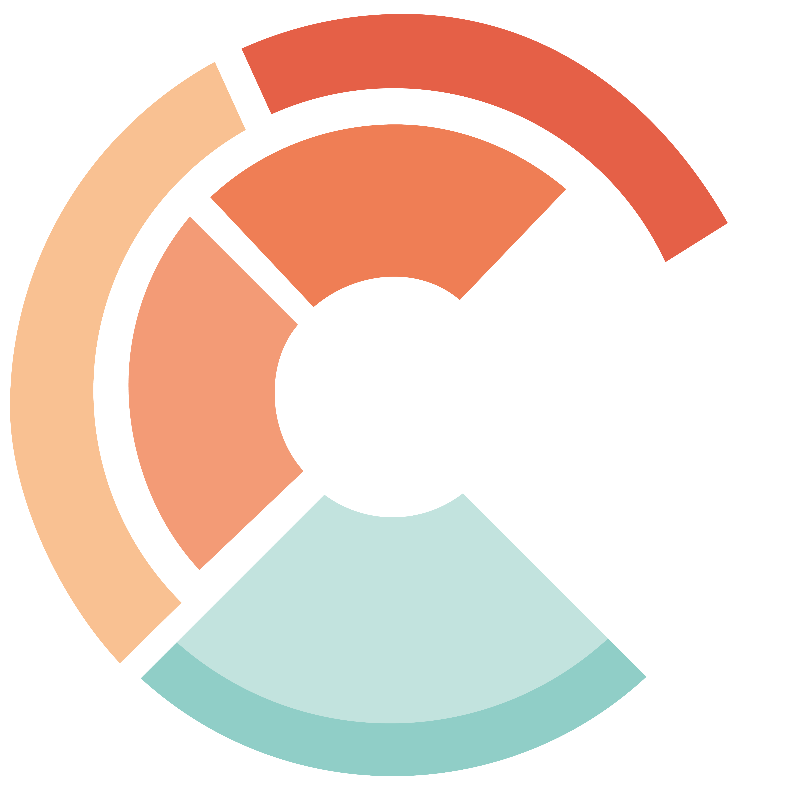{style="width: 20%; height: 30%; object-fit: cover; object-position: 0 0;" .absolute top=33% right=5%}


## References

::: {#refs}
:::
