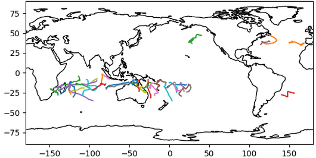

## Talk overview
- TCTrack
    - Background
    - Code structure & results

- Python type hinting musings
    - Type hinting basics
    - Type hinting in Pyrealm
    - Limitations

# TCTrack - Tropical Cyclone Tracking Library


## Premise
- There are many different algorithms and software for generating tropical cyclone tracks.
    - *TempestExtremes, TRACK, TSTORMS, CyTrack, ...*
- Each with different data formats and interfaces.

::: {.fragment}
- **AIM**: Create a single library with:
    - Standardised interface
    - Consistent inputs, and outputs
    - Easy extensibility
:::

## Library structure
- Trackers inherit from an abstract base class with:
    - Standardised `run_tracker` method.
    - A method for extracting metadata from the input files.
    - A `to_netcdf` method for generating output files.
- Tracker parameters also inherit from an abstract base class

::: {.fragment}
- Implemented so far:
    - TempestExtremes
    - TRACK (in progress)
:::

## Code example - TempestExtremes
```python
from tctrack import tempest_extremes as te

# Define tracker parameters
dn_params = te.DetectNodesParameters(
    in_data=input_file_list,
    search_by_min="psl",
    time_filter="6hr",
    ...
)

sn_params = te.StitchNodesParameters(
    max_sep=8.0,
    min_time="54h",
    max_gap="24h",
    ...
)

# Create and run tracker
te_tracker = te.TETracker(dn_params, sn_params)
te_tracker.run_tracker("output_tracks.nc")
```

## Code example - TRACK
```python
from tctrack import track as tr

# Define tracker parameters
params = tr.TRACKParameters(
    in_data=input_file,
    filter_distance=10,
    ...
)

# Create and run tracker
tr_tracker = tr.TRACKTracker(params)
tr_tracker.run_tracker("output_tracks.nc")
```

## Results
Results for 3 months of tracks in 1950.

::::: {.columns}

:::: {.column width="50%" style="text-align: center;"}
::: {.fragment}
TempestExtremes

:::
::::

:::: {.column width="50%" style="text-align: center;"}
::: {.fragment}
TRACK

:::
::::

:::::

::: {.incremental}
- ...still some work to do.
- And other algorithms to add.
:::


# Python typing limitations
<div style="font-size:50px;">Lessons from the Pyrealm project</div>

## Pyrealm work
<div style="display:flex; align-items:center;">
<div style="flex: 1; padding-right: 1em;">

</div>
<div style="flex: 2;">
Plant productivity and ecosystem modelling library.
</div>
</div>

:::{.incremental}
- Previously required numpy array inputs of the same shape
  ```python
  dataset = xr.open_dataset(file_path, engine="netcdf4")
  temp = dataset["temp"]
  co2 = dataset["CO2"]
  
  # Convert to numpy and broadcast to same shape
  temp = temp.as_numpy()
  co2 = np.broadcast_to(temp, co2.as_numpy())
  
  pyrealm.func(temp, co2)
  ```
- **AIM**: Allow XArray inputs directly.
:::

## Python typing basics
- Basic syntax
  ```python
  def area(width: float, height: float) -> float:
      return width * height

  value : float = area(3, 2)
  ```
- Why use it?
    - Self documenting code
    - Static analysis & error checking
    - IDE support / autocompletion
- **Make sure you know your primary use-case**

## Static Analysis
- "Compile-time" error checking.
- All rules can be broken and ignored:<br>`# type: ignore[rule-name]`
- Effectively running two separate codes - python & mypy.
    - Valid python may not be allowed by mypy.

## Aside - type narrowing
- Type hinting supports dynamic type redefinition, but only for type narrowing.
```python
x : int | str = 1
reveal_type(x) # Type is "int"
x = str(x)
reveal_type(x) # Type is "str"
```
- But it doesn't work if you try to explicitly change the type:
```python
x : int | str = 1
x : str = str(x) # mypy error
```

::: {.fragment}
<div style="line-height: 0.8;">
- Two types:
    - Declared types - Cannot be changed
    - Inferred types 
</div>
:::

## Aside - type narrowing
Narrowing is strict and doesn't work, for example, on dictionary types:
```python
dict1 : dict[str, int | str]
dict2 : dict[str, int] = {'a': 1}
dict1 = dict2 # mypy error
```
This is relevant when using `kwargs`:
```python
def func(**kwargs: int | str) {
	new_kwargs : dict[str, int] = {'a': 1}
	kwargs = new_kwargs # mypy error
}
```

## (Unexpected) Typing benefit
- We wanted to relax the constraint on equal shape inputs.
  ```python
  temp_2d = np.full((n1, n2), 25)
  co2_1d = np.full(n2, 200)
  
  # Before: needed to broadcast
  co2_2d = np.broadcast_to(co2_1d, (n1, n2))
  pyrealm.func(temp_2d, co2_2d)
  
  # After: just add dimension
  pyrealm.func(temp_2d, co2_1d[1,:])
  ```

::: {.incremental}
- Need to test the whole codebase! 😱
- Type annotations enable function parameter generation.<br>-> Can automate testing!
:::

## Pyrealm - XArray inputs decorator
- Next wanted to allow xarray parameters.

::: {.fragment}
- I created a decorator to conveniently convert:
  ```python
  def func(..., array_arg: NDArray, ...): ...
  ```
  into:
  ```python
  def func(..., array_arg: NDArray | xr.DataArray, ...): ...
  ```
  simply by adding:
  ```python
  @xarray_inputs
  def func(...): ...
  ```
:::

::: {.fragment}
- This was perfectly reasonable python code...
:::

## But...
There is no way to dynamically convert types using static type hints!

::: {.incremental}
- Decorators can add parameters:
  ```python
  P = ParamSpec("P")
  R = TypeVar("R")

  def add_arg(func: Callable[P, R]) -> Callable[Concatenate[bool, P], R]:
      def wrapper(new_arg: bool, *args: P.args, **kwargs: P.kwargs) -> R:
          ...
      return wrapper
  
  @add_arg
  def func(): ...
  ```
:::


## But...
There is no way to dynamically convert types using static type hints!

- And can change a specific parameter's type:
  ```python{style="max-height:260px;"}
  P = ParamSpec("P")
  R = TypeVar("R")
  T = TypeVar("T")

  def change_arg(
      func: Callable[Concatenate[T, P], R]
  ) -> Callable[Concatenate[bool, P], R]:
      def wrapper(first: bool, *args: P.args, **kwargs: P.kwargs) -> R:
          ...
          return(first2, *args, **kwargs)
      return wrapper
  
  @change_arg
  def func(): ...
  ```

::: {.incremental}
- But cannot change arbitrary parameters.
:::

## Other limitations
- Problems occur whenever types are only known at runtime.

<br>

##### Also limitations in typing that don't affect python:

- Cannot specify dimensions or shapes of arrays.

## Using generic types (e.g. `Any`)
- Useful in overly complicated or otherwise impossible situations.
- Generic return types can cause issues down the line.
- Best used in internal functions so types can be manually defined before user-facing functions.

## Conclusion
<div style="line-height: 2;">
- Know your goal: readablity or static analysis.
- Typing can be unexpectedly useful.
- But it can limit python code.
</div>
