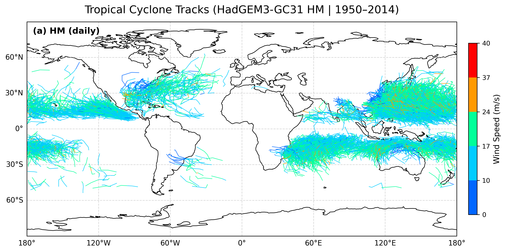
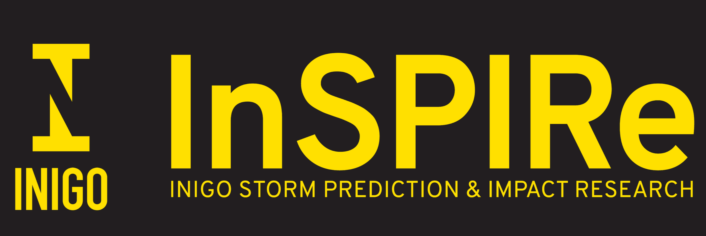

---
project:
  output-dir: _site
output-file: index
title: "<br><br>TCTrack: Working with researchers to enable FAIR tropical cyclone tracking"
format:
  revealjs:
    embed-resources: false
    slide-number: false
    chalkboard: false
    preview-links: auto
    history: false
    highlight-style: a11y
    code-overflow: wrap
    code-line-numbers: false
    logo: images/UCAM_ICCS_Logo.png
    theme: simple
mermaid:
  theme: neutral
authors:
  - name: Sam Avis
    # orcid: 0000-0001-9637-9489
  - name: Jack Atkinson
    # orcid: 0000-0001-5001-4812
  - name: Simon Sadler
  - name: Surbhi Goel
  - name: Charles Powell
  - name: Alison Ming
date: "2026-09-10"
include-in-header:
  - text: |
      <style>
      #title-slide .title {
        font-size: 1.25em;
        margin-bottom: 0.5em;
      }
      #title-slide .quarto-title-authors {
        font-size: 0.7em;
        display: block;
      }
      #title-slide .quarto-title-author {
        display: inline-block;
      }
      #title-slide .quarto-title-affiliation {
        display: none;
      }
      #title-slide .quarto-title-authors::after {
        content: "Institute of Computing for Climate Science, University of Cambridge, UK";
        display: block;
        margin-top: 0.5em;
      }
      #title-slide .title::before {
        content: "";
        display: inline-block;
        vertical-align: middle;
        width: 550px;
        height: 175px;
        background: url('images/TCTrack_Logo.svg') no-repeat center/contain;
      }
      .fair-output-box {
        box-sizing: border-box;
        overflow: auto;
        border: 1px solid currentColor;
        padding: 0.25em;
        font-size: 0.8em;
      }
      .fair-output-box pre {
        margin: 0;
      }
      .fair-output-box pre > code {
        white-space: pre;
      }
      .reveal pre.metadata-height code {
        max-height: 40ex;
      }
      .reveal .slides section h2 {
        margin-bottom: 1ex;
      }
      .reveal .small-mermaid svg {
        transform: scale(2);
      }
      </style>
---

## The starting problem
**Topic:** Identifying tropical cyclone tracks from gridded data (simulations, forecasts, historical reanalysis data)

<br>

:::: {.columns}
::: {.column width="55%"}
**Problem:**

- Multiple tracking algorithms exist, but give different results.
- We want a code that implements them with a unified interface.
:::
::: {.column width="45%"}
{width=92% fig-alt="Map showing tropical cyclone tracks"}
:::
::::

## Applying RSE expertise - Don't reinvent the wheel

**Initial plan:** Reimplement tracking algorithms in Python - researchers did not have full knowledge of existing domain software.

Also, existing codes were not necessarily well documented / work on all systems.

<br>

**New plan:** Understand and build on what is already there to improve code sustainability - RSE expertise needed.

## Applying RSE expertise - The framework

```{mermaid}
flowchart LR
    
    subgraph User
    I[(Input data)]
    P[Tracker parameters]
    end
    I --> T[TCTrack]
    P --> T
    T --> A[External tracking algorithm]
    A --> T
    T --> O[(Output data)]
```

- TCTrack only needs an interface and parameters for each tracking algorithm.
- Easily extensible to encourage community contributions.

## Building domain experience

To wrap the tracking algorithms, we had to gain an understanding of them rather than treating them as black boxes.

We were able to identify themes across algorithms.

e.g. Broadly 3 main steps:

```{mermaid}
flowchart LR
    A[Preprocessing] --> B[Detection]
    B --> C[Stitching]
```


## Building domain experience

::: {style="font-size: 0.8em;"}
We want to expose as many parameters and functionality from the underlying code as possible.
:::

::: {style="max-height: 20ex; overflow-y: auto; font-size: 0.62em;"}
```{.python}
detect_params = te.TEDetectParameters(
    search_by_min="msl",
    time_filter="6hr",
    merge_dist=6.0,
    closed_contours=[
        te.TEContour(var="msl", delta=200.0, dist=5.5),
        te.TEContour(var="_DIFF(zg(300hPa),zg(500hPa))", delta=-6.0, dist=6.5, minmaxdist=1.0),
    ],
    output_commands=[
        te.TEOutputCommand(var="msl", operator="min"),
        te.TEOutputCommand(var="orog", operator="max"),
        te.TEOutputCommand(var="si10", operator="max", dist=2.0),
    ],
)

stitch_params = te.TEStitchParameters(
    caltype="360_day",
    max_sep=8.0,
    min_time="54h",
    max_gap="24h",
    min_endpoint_dist=8.0,
    threshold_filters=[
        te.TEThreshold(var="latitude", op="<=", value=50, count=10),
        te.TEThreshold(var="latitude", op=">=", value=-50, count=10),
        te.TEThreshold(var="orog", op="<=", value=150, count=10),
        te.TEThreshold(var="si10", op=">=", value=10, count=10),
    ],
)
```
:::

::: {style="font-size: 0.8em;"}
Equally, we want to keep it simple to use - e.g. default parameter sets.
:::

::: {style="max-height: 330px; overflow-y: auto; font-size: 0.62em;"}
```{.python}
detect_params, stitch_params = te.parameter_set("UZ")
```
:::

To do this we need a good understanding of how the codes work and how the algorithms are used in research.

## FAIR outputs: the problem

:::: {.columns}
::: {.column width="50%"}

::: {.fair-output-box style="max-height: 15ex;"}
```{.plaintext}
start     2  1950     1     4     0
   54.67  -22.15   16.65  999.23   0.00027446  1950     1     4     0
   55.72  -24.49   17.38  997.83   0.00031078  1950     1     5     0
start    13  1950     1     6     0
   67.32   -9.26   17.90 1002.11   0.00065708  1950     1     6     0
   67.68   -9.26   15.32 1003.88   0.00044106  1950     1     7     0
...
```
:::

::: {.fair-output-box style="max-height: 15ex;"}
```{.plaintext}
track_id, year, month, day, hour, i, j, lon, lat, psl, orog, sfcWind
0, 1950, 1, 1, 6, 572, 320, 201.269531, -14.882813, 1.003118e+05, 0.000000e+00, 1.389075e+01
0, 1950, 1, 1, 12, 569, 318, 200.214844, -15.351562, 1.001075e+05, 0.000000e+00, 1.546506e+01
0, 1950, 1, 1, 18, 567, 317, 199.511719, -15.585937, 1.001445e+05, 0.000000e+00, 1.590697e+01
0, 1950, 1, 2, 0, 565, 320, 198.808594, -14.882813, 1.000154e+05, 0.000000e+00, 1.531368e+01
...
```
:::

::: {.fair-output-box style="max-height: 15ex;"}
```{.plaintext}
netcdf ff_trs.test_out {
dimensions:
        tracks = 703 ;
        record = UNLIMITED ; // (78 currently)
variables:
        int TRACK_ID(tracks) ;
                TRACK_ID:add_fld_num = 0 ;
                TRACK_ID:tot_add_fld_num = 0 ;
                TRACK_ID:loc_flags = "" ;
        int FIRST_PT(tracks) ;
        int NUM_PTS(tracks) ;
        int index(record) ;
        int time(record) ;
        float longitude(record) ;
        float latitude(record) ;
        float intensity(record) ;
}
```
:::

:::

::: {.column width="50%"}
- Different format for every algorithm
- Unclear what each value represents
- Limited metadata
- Cannot reproduce
:::
::::

## FAIR outputs: standardised format

All TCTrack outputs are converted into CF-Compliant NetCDF.

Again build on existing software by heavily relying on cf-python (Thanks to the NCAS RSE team!)

<!-- ```{.json .code-overflow-scroll style="font-size: 0.7em; max-height: 30ex; overflow: auto;"} -->
```{.json .code-overflow-scroll .metadata-height style="font-size: 0.7em;"}
netcdf my_tracks {
dimensions:
        trajectory = 36 ;
        observation = 60 ;
variables:
        int64 trajectory(trajectory) ;
                trajectory:standard_name = "trajectory" ;
                trajectory:cf_role = "trajectory_id" ;
                trajectory:long_name = "trajectory index" ;
        int64 observation(observation) ;
                observation:standard_name = "observation" ;
                observation:long_name = "observation index" ;
        double time(trajectory, observation) ;
                time:standard_name = "time" ;
                time:long_name = "time" ;
                time:units = "days since 1970-01-01" ;
                time:calendar = "360_day" ;
        double lat(trajectory, observation) ;
                lat:standard_name = "lat" ;
                lat:long_name = "latitude" ;
                lat:units = "degrees_north" ;
        double lon(trajectory, observation) ;
                lon:standard_name = "lon" ;
                lon:long_name = "longitude" ;
                lon:units = "degrees_east" ;
        double grid_i(trajectory, observation) ;
                grid_i:long_name = "longitudinal grid index" ;
                grid_i:coordinates = "time lat lon" ;
        double grid_j(trajectory, observation) ;
                grid_j:long_name = "latitudinal grid index" ;
                grid_j:coordinates = "time lat lon" ;
        double air_pressure_at_sea_level(trajectory, observation) ;
                air_pressure_at_sea_level:standard_name = "air_pressure_at_sea_level" ;
                air_pressure_at_sea_level:long_name = "Sea Level Pressure" ;
                air_pressure_at_sea_level:units = "Pa" ;
                air_pressure_at_sea_level:coordinates = "time lat lon" ;
                air_pressure_at_sea_level:cell_methods = "area: point" ;
        double surface_altitude(trajectory, observation) ;
                surface_altitude:standard_name = "surface_altitude" ;
                surface_altitude:long_name = "Surface Altitude" ;
                surface_altitude:units = "m" ;
                surface_altitude:coordinates = "time lat lon" ;
                surface_altitude:cell_methods = "area: point" ;
        double wind_speed(trajectory, observation) ;
                wind_speed:standard_name = "wind_speed" ;
                wind_speed:long_name = "Near-Surface Wind Speed" ;
                wind_speed:units = "m s-1" ;
                wind_speed:coordinates = "time lat lon" ;
                wind_speed:cell_methods = "area: maximum (great circle of radius 2.0 degrees)" ;

// global attributes:
                :Conventions = "CF-1.12" ;
                :featureType = "trajectory" ;
                :tctrack_version = "0.3" ;
                :tctrack_tracker = "TETracker" ;
                :detect_nodes_parameters = "{\"in_data\": [\"psl_data.nc\", \"zg_data.nc\", \"orog_data.nc\", \"sfcWind_data.nc\"], \"out_header\": true, \"output_file\": \"nodes_out.dat\", \"search_by_min\": \"psl\", \"search_by_max\": null, \"closed_contours\": [{\"var\": \"psl\", \"delta\": 200.0, \"dist\": 5.5, \"minmaxdist\": 0.0}, {\"var\": \"zgdiff\", \"delta\": -6.0, \"dist\": 6.5, \"minmaxdist\": 1.0}], \"merge_dist\": 6.0, \"time_filter\": \"6hr\", \"lat_name\": \"lat\", \"lon_name\": \"lon\", \"min_lat\": 0.0, \"max_lat\": 0.0, \"min_lon\": 0.0, \"max_lon\": 0.0, \"regional\": false, \"output_commands\": [{\"var\": \"psl\", \"operator\": \"min\", \"dist\": 0.0}, {\"var\": \"orog\", \"operator\": \"max\", \"dist\": 0.0}, {\"var\": \"sfcWind\", \"operator\": \"max\", \"dist\": 2.0}]}" ;
                :stitch_nodes_parameters = "{\"output_file\": \"tracks_out.txt\", \"in_file\": \"nodes_out.dat\", \"in_list\": null, \"in_fmt\": [\"lon\", \"lat\", \"psl\", \"orog\", \"sfcWind\"], \"allow_repeated_times\": false, \"caltype\": \"360_day\", \"time_begin\": null, \"time_end\": null, \"max_sep\": 8.0, \"max_gap\": \"24h\", \"min_time\": \"54h\", \"min_endpoint_dist\": 8.0, \"min_path_dist\": 0, \"threshold_filters\": [{\"var\": \"lat\", \"op\": \"<=\", \"value\": 50, \"count\": 10}, {\"var\": \"lat\", \"op\": \">=\", \"value\": -50, \"count\": 10}, {\"var\": \"orog\", \"op\": \"<=\", \"value\": 150, \"count\": 10}, {\"var\": \"sfcWind\", \"op\": \">=\", \"value\": 10, \"count\": 10}], \"prioritize\": null, \"add_velocity\": false, \"out_file_format\": \"gfdl\", \"out_seconds\": false}" ;
}
```


## FAIR outputs: metadata

Included metadata:

- Variable metadata (copied from input files)
- TCTrack metadata
  - Version
  - Tracking algorithm
  - Tracking parameters

Solves the familiar problem: "How did we get this result?"

## FAIR outputs: reproducibility

The metadata is machine-readable, further simplifying reproduction:

```{.python}
from tctrack.utils import load_tracker_metadata
tracker, params = load_tracker_metadata("tracks_output.nc")
tracker.run_tracker("tracks_output_2.nc")
```

## Conclusions

1. **RSE support** helped to create a more useful software for the community.
2. **Domain knowledge** helped us improve ease of use for researchers' workflows.
3. **FAIR outputs** improve the usability of research outputs.

:::: {.columns}
::: {.column style="width: 60%; font-size: 0.7em"}
<br>
[github.com/Cambridge-ICCS/TCTrack](https://github.com/Cambridge-ICCS/TCTrack)
<br><br>
[tctrack.readthedocs.io](https://tctrack.readthedocs.io)
:::
::: {.column style="width: 40%; text-align: center;"}
{width=60% fig-alt="INIGO and InSPIRe logos"}
{width=60% fig-alt="Scmidt Sciences logo"}
:::
::::
